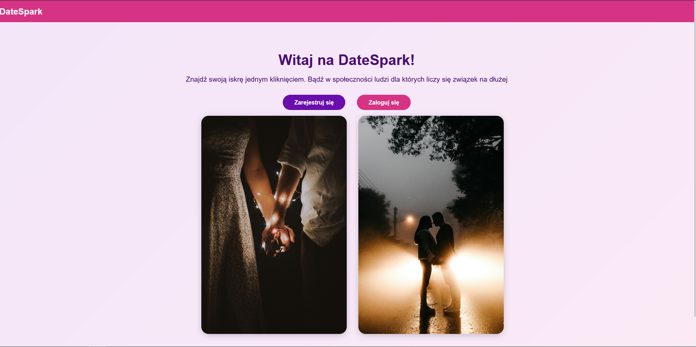

# Projekt Wdpai

### Project setup
#### Step 1
Navigate to docker folder in terminal and run
```
docker compose up -d
or 
docker-compose up -d
```
#### Step 2
Get PHP container id (form docker desktop or from terminal) and execute
```
docker exec -it {container_id} sh
```

While in container run migration script one after another (order matter here)
```
./migrate.sh
./seed.sh
```

After that navigate to localhost:8000 

All available views can be seen in entries/views.php and all api endpoints can be seen in entries/api.php




## Database schema
